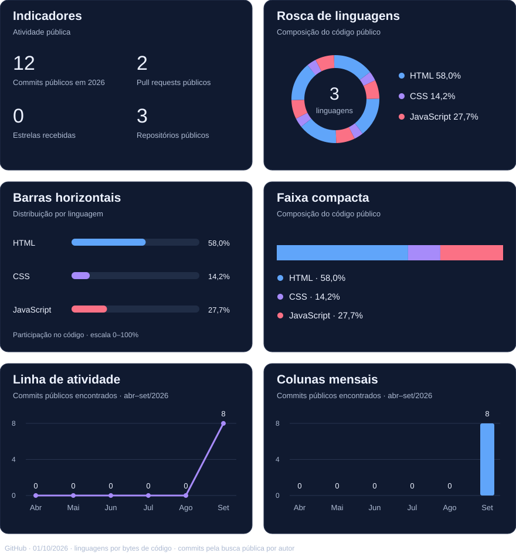

## Sobre mim

Sou **Rafael Gindro, Técnico em Segurança do Trabalho** e entusiasta da tecnologia. Gosto de entender como as coisas funcionam, resolver problemas e transformar ideias em projetos práticos.

No desenvolvimento web, utilizo **HTML, CSS e JavaScript** para criar e aprimorar meus projetos. Atualmente, estudo **banco de dados e algoritmos** para aprofundar meus conhecimentos em programação.

Este espaço reúne meu portfólio, os projetos que desenvolvo e minha evolução no aprendizado.

## Tecnologias e aprendizado

**Estudando:** Engenharia de Software

## Projetos em destaque

| Portfólio pessoal | Instituto Caminhos do Bem |
| --- | --- |
| Apresentação das minhas atividades, competências e projetos. | Projeto web desenvolvido para o Instituto Caminhos do Bem. |
| [Explorar projeto →](https://github.com/rafagiindro/Portfolio) | [Explorar projeto →](https://github.com/rafagiindro/ONG) |

## Atividade e linguagens

## 🐍 Snake

<picture>
  <source media="(prefers-color-scheme: dark)" srcset="https://raw.githubusercontent.com/rafagiindro/rafagiindro/output/github-snake-dark.svg">
  <source media="(prefers-color-scheme: light)" srcset="https://raw.githubusercontent.com/rafagiindro/rafagiindro/output/github-snake.svg">
  
</picture>

## 👻 Pac-Man

